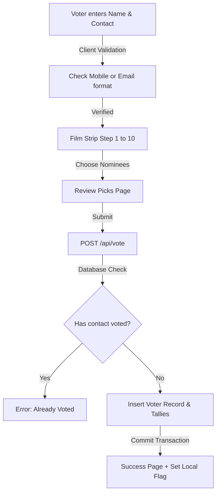

# 🏆 Pratibha Season 2 — Voting & Administration Platform

An elegant, secure, and mobile-responsive digital voting system designed for the **Pratibha Season 2 Awards**, presented by the **Sambalpuriya Youth Association**. The platform showcases regional talent across 10 categories, allowing verified users to cast votes, while providing admins with a secure, real-time results dashboard and voter registration logs.

---

## 🌟 Key Features

*   **Responsive Voting Flow**: Seamless 3-step wizard (Verify Identity → Cast Votes across 10 Categories → Review & Submit).
*   **Film Reel Progress Strip**: A visual negative film strip acting as a progress bar, rendering category poster thumbnails that light up as the user votes.
*   **Local SQLite Database**: A self-contained database (`votes.db`) with auto-migrated schemas and atomic database transactions.
*   **Secure Administration Dashboard**: Gatekeeper passcode login, HTTP-only cookie session management, live results leaderboards with dynamic percentage share progress bars, and leading indicators.
*   **Segmented Voter Reports**: A separate, paginated logs view for admins to view voter registry details (Names, Mobile/Email, timestamps) in Indian Standard Time (IST).

---

## 📁 Folder Structure

```text
pratibha-season-2-awards/
├── app/                        # Next.js App Router Pages & API Routes
│   ├── admin/                  # Admin Dashboard Views
│   │   ├── page.tsx            # Login panel / results charts
│   │   └── voters/             # Separate voter registration report
│   │       └── page.tsx
│   ├── api/
│   │   └── vote/
│   │       └── route.ts        # Vote receiver & SQLite transaction API
│   ├── globals.css             # Glassmorphic themes & gold gradients
│   ├── layout.tsx
│   └── page.tsx                # Multi-step voter wizard
├── components/                 # Shared UI Components
│   ├── FilmReelProgress.tsx    # Responsive visual film progress bar
│   └── NomineeCard.tsx         # Nominee details & image display card
├── lib/                        # Backend Helpers & Constants
│   ├── categories.ts           # Categories config & Nominees registry
│   ├── db.ts                   # SQLite client, schema creator & migrator
│   └── validate.ts             # Contact details validator & formatter
├── public/                     # Static Local Assets (create to customize images)
│   ├── nominees/               # Place candidate portraits here
│   └── categories/             # Place progress bar category cards here
├── .env.example                # Admin credentials configuration template
├── .gitignore                  # Keeps your votes.db local & secure
├── package.json
├── README.md                   # Platform documentation
└── tsconfig.json
```

---

## ⚙️ Technical Workflow & System Design



### 1. Verification Phase (Step 1 of 3)
*   **User Action**: The voter inputs their Full Name and chooses validation by Indian Mobile Number (10 digits) or Email Address.
*   **Validation**: The system runs formatting checks using `lib/validate.ts` before unlocking the voting ballot.

### 2. Balloting Phase (Step 2 of 3)
*   **User Action**: The voter navigates the 10 film strip steps, selecting exactly one nominee per category.
*   **Film Reel strip**: The `FilmReelProgress` bar renders category poster images that switch from a dark, low-opacity negative view into a lit, colored card frame once a vote is cast.

### 3. Submission Phase (Step 3 of 3)
*   **User Action**: Review selected nominees alongside their photo avatars and click **Submit**.
*   **Transaction Block**: Next.js API route (`app/api/vote/route.ts`) takes the ballot, opens a transaction in SQLite, checks that the contact has not voted yet (due to the `voters.contact` unique constraint), inserts the registration details, increments the nominee tallies, and commits the records.

### 4. Admin Inspection
*   **Results Panel (`/admin`)**: Admins authenticate using `ADMIN_PASSCODE` (default `admin123`). This issues a secure HTTP-only cookie. The dashboard renders live metrics and nominee ranking bars.
*   **Data Logs (`/admin/voters`)**: Displays detailed voter lists in a separate logs grid. Timestamps are formatted to India Standard Time (IST) for easy reference.

---

## 🚀 Getting Started

### 1. Local Installation
Make sure you have Node.js installed, then clone and launch the project:

```bash
# Install node packages
npm install

# Run dev server
npm run dev
```
Open [http://localhost:3000](http://localhost:3000) in your browser.

### 2. Testing on Real Devices (Mobile Wi-Fi)
To test responsiveness and vote inputs directly from your smartphone, run the dev server binding to all network interfaces:

```bash
npm run dev -- --hostname 0.0.0.0
```
Then find your computer's local IP address (`ipconfig` on Windows) and open `http://<your-ip>:3000` on your phone's browser.

### 3. Database Administration
To inspect database records directly from your console:
```bash
# Query the live vote tallies table
sqlite3 votes.db "select * from vote_tallies;"
```

---

## 🎨 Asset Customization

### Local Images
To replace the Unsplash stock pictures with your official nominees and category assets:
1.  Create a `public/` directory in your root folder.
2.  Save your images under `public/nominees/` and `public/categories/`.
3.  Open `lib/categories.ts` and set the paths (starting with `/` since `public` is the root asset directory):
    ```typescript
    // In lib/categories.ts
    thumbnailUrl: "/categories/best-actor.jpg",
    nominees: [
      { id: "n1", name: "Aditya Sahu", imageUrl: "/nominees/aditya.jpg" }
    ]
    ```

### Production Deployment
Since SQLite stores information in a local `votes.db` file, standard serverless hosting (e.g. Vercel/Netlify) will lose database records when the worker container sleeps. 
*   **Recommended**: Deploy to a VPS or PaaS provider with persistent volume mounts (like **Railway**, **Render**, or **Fly.io**).
*   **Cloud SQL Alternative**: If you wish to host on Vercel, replace `better-sqlite3` with `@libsql/client` to connect to a cloud SQLite server like **Turso**.
